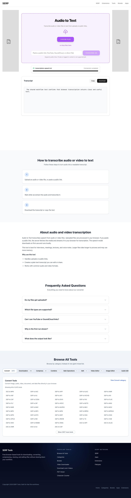
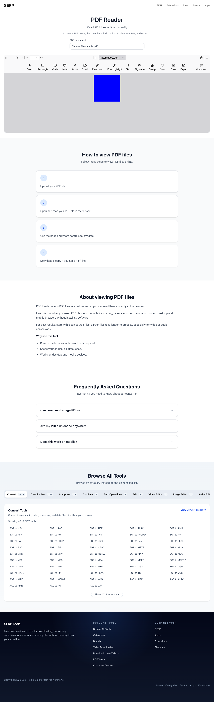
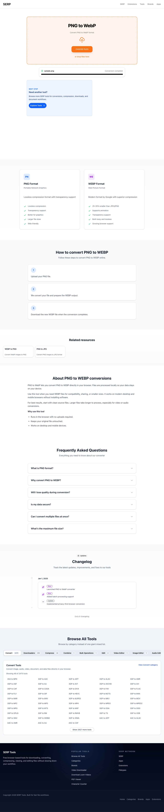

# Workflow preview: human review packet — 2026-08-12

This is a plain-language review of the isolated Wayfinder preview at runtime
revision `03dc90f5213560ff61493dd058b877f9666b8338`. It is dated evidence, not a
claim about production.

## Open the usable preview

- [Browse the preview](https://tools-serp-co-wayfinder-preview.serpcompany.workers.dev/)
- [Convert PNG to WebP](https://tools-serp-co-wayfinder-preview.serpcompany.workers.dev/png-to-webp/)
- [Turn speech into text](https://tools-serp-co-wayfinder-preview.serpcompany.workers.dev/audio-to-text/)
- [Open a PDF](https://tools-serp-co-wayfinder-preview.serpcompany.workers.dev/pdf-reader/)
- [Combine CSV files](https://tools-serp-co-wayfinder-preview.serpcompany.workers.dev/csv-combiner/)
- [Convert CSV to JSON](https://tools-serp-co-wayfinder-preview.serpcompany.workers.dev/csv-to-json/)
- [Count characters and words](https://tools-serp-co-wayfinder-preview.serpcompany.workers.dev/character-counter/)

This preview is safe to try with disposable files. Do not use private or
sensitive data for review.

## What the completed operations look like

### Speech to text

The deployed browser processed a real speech MP3 and produced readable text.

### PDF reader

The deployed browser opened a real PDF and rendered page 1 in the maintained
viewer.

### PNG to WebP

The deployed browser accepted a real PNG and completed the WebP conversion.

## Five-minute review

1. Open the three links above and try one disposable file in each.
2. Confirm that the wording, controls, result, and download behavior make sense.
3. Browse the home page and one category. Note anything confusing or ugly.
4. Decide whether this is good enough to become the new base for continued
   improvement, or name the specific experience that must change first.

Choose one response in GitHub issue #89:

- **Accept the base** — continue expanding verified Tool families from this
  architecture. This does not deploy production automatically.
- **Request changes** — name the concrete screen or behavior that must change;
  it becomes a bounded blocker.
- **Defer** — keep the draft unmerged while product direction is reconsidered.

## Honest limitations

- This work verifies 426 of 2,807 active Tool IDs at the recorded baseline.
- 2,378 operations intentionally refuse to produce an unverified or mislabeled
  result. A visible route does not mean its operation is supported.
- Server-native image, video/audio, and PDF compression remain unavailable in
  Cloudflare Workers. Issue #91 asks whether to leave them unavailable, rebuild
  them for Workers, or operate a separate processing service.
- The editor IDs `audio-editor`, `image-editor`, and `video-editor` remain
  explicitly unknown.
- Production was not deployed or tested by this review.

## Automated evidence in ordinary language

- The repository check passed on Node 22, including 129 workflow and ownership
  tests plus the Cloudflare production build.
- The deployed preview canary passed 26 checks: pages, bindings, browser-worker
  resources, transcription model resources, direct MP4 streaming, SVG, and
  truthful unavailable responses.
- The decisive browser run passed both real-speech transcription and real-PDF
  rendering.

The detailed machine artifacts are retained under run IDs
`20260812T083230Z_03dc90f_pull-request_cloudflare-preview` and
`20260812T083305Z_03dc90f_pull-request_browser-smoke-preview-subset`.
